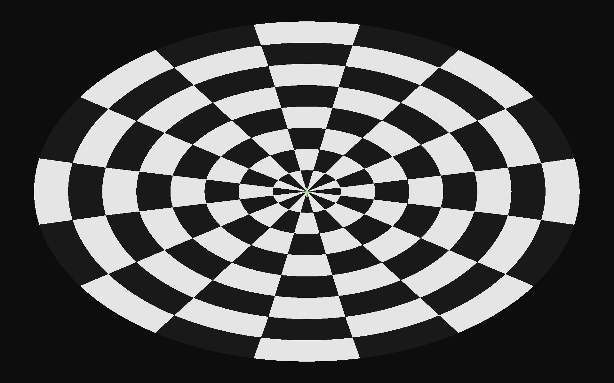

# radial checkerboard stimulus
A simple paradigm which displays a fixation mark for resting peroid (time required for receiving `Rest_trig` triggers) and flickering checkboard during stimulation period (time required for receiving `Stimuli_trig` triggers). Use `Debug` flag to display trigger counts on the screeen. It also tried to log the setting and events in `%TEMP%\\fmri_radialChecker_YYYYMMDD-HHMMSS.txt`.

# Parsing log file to FSL paradigm 
FSL's three column format(stimulus onset| stimulus duration| stimulus strength) 
```matalb
 dat=textscan(fopen('fmri_radialChecker_20221221-122717.txt'),'%d %f %d','HeaderLines',11);
 vTR=mean(diff(dat{2}-dat{2}(1))); %s
 stim= [dat{2}(diff([0; dat{3}])>0)-dat{2}(1) vTR+dat{2}(diff([dat{3};0])<0)-dat{2}(diff([0; dat{3}])>0)];
 stim=padarray(stim,[0 1],1,'post');
 fprintf(fopen('stim.txt','w+'),'%.4f %.4f %d\n',stim');
```

## checkerboard pattern

